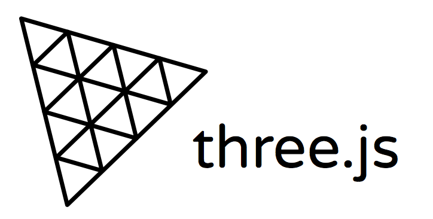
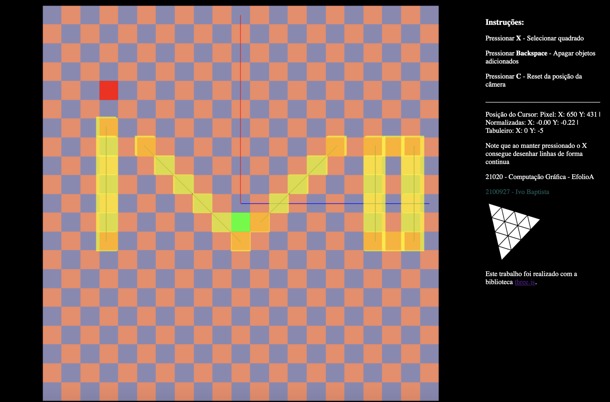

<h1 align="center">
    
</h1>

EfolioA de Computação Grafica

Funcionamento de Three.js
    
 Programa utiliza a biblioteca Three.js para renderizar um grafico em 3D interativo.

📌 EfolioA de Computação Grafica - biblioteca Three.js
------------------
 Implementação do algoritmo do ponto médio e Interface Gráfico 
 
## Sintaxe para executar:

<pre>docker compose up -d </pre>

Demo: http://server.ivo.com.pt:8080

Video: https://youtu.be/Dbs-P95D0Q4

O projeto foi feito em Html, Javasript e Css

The project was done with Html, Javascript and Css

🔧 Tecnologias utilizadas:
------------------

- html
- Javascript (biblioteca three.js)
- Css

💬 Fale comigo
------------------
[*Entre em contato comigo*](https://www.linkedin.com/in/ivo-baptista-3712144/)

